# Auto-Healing Agent Workflow

This is a **precise Mermaid flowchart** showing exactly how the auto-healing agent works internally, including all stages, iterations, planning, verification, and feedback loops.

```mermaid
flowchart TD
    Start([🚀 python auto_heal.py repo_path issue_description --iterations N --timeout S]) --> ParseArgs[📝 Parse Arguments<br/>- repository path<br/>- issue description<br/>- max iterations<br/>- timeout seconds<br/>- service account path]
    
    ParseArgs --> CreateAgent[🏗️ Create AutoHealingAgent<br/>- Initialize service account<br/>- Set up intelligence components<br/>- Create session object]
    
    CreateAgent --> Stage1[🔧 Stage 1: Initialization & Validation]
    
    Stage1 --> CheckRepo{📁 Repository exists?}
    CheckRepo -->|❌ No| ErrorRepo[❌ Repository not found<br/>Exit Code 1]
    CheckRepo -->|✅ Yes| CheckSA{🔑 Service account exists?}
    
    CheckSA -->|❌ No| ErrorSA[❌ Service account not found<br/>Exit Code 1]
    CheckSA -->|✅ Yes| CheckModules{🧠 Intelligence modules available?}
    
    CheckModules -->|❌ No| ErrorModules[❌ Intelligence modules missing<br/>Exit Code 1]
    CheckModules -->|✅ Yes| Stage2[📊 Stage 2: Repository Analysis]
    
    Stage2 --> FastAnalyzer[⚡ FastRepositoryAnalyzer<br/>- Index all files<br/>- Extract symbols<br/>- Build dependency graph<br/>- Track file changes]
    
    FastAnalyzer --> AnalyzeFiles[📊 Analyze Files<br/>- Python: AST parsing<br/>- JavaScript: Basic parsing<br/>- YAML/JSON: Structure analysis<br/>- Skip unsupported files]
    
    AnalyzeFiles --> Stage3[🕸️ Stage 3: Knowledge Graph Building]
    
    Stage3 --> BuildKG[🕸️ KnowledgeGraph<br/>- Create nodes from symbols<br/>- Create edges from dependencies<br/>- Add file relationships<br/>- Cache graph structure]
    
    BuildKG --> Stage4[🤖 Stage 4: LLM Initialization]
    
    Stage4 --> InitLLM{🤖 Initialize Vertex AI?}
    InitLLM -->|❌ Fail| ErrorLLM[❌ LLM initialization failed<br/>Exit Code 1]
    InitLLM -->|✅ Success| Stage5[🧠 Stage 5: Strategic Planning]
    
    Stage5 --> CreatePlanner[🧠 StrategicPlanningAgent<br/>- Analyze repository structure<br/>- Classify issues by severity<br/>- Build dependency order<br/>- Create repair tasks]
    
    CreatePlanner --> RunVerification[🔍 Run Initial Verification<br/>CodeVerificationAgent<br/>- Syntax check all files<br/>- Import validation<br/>- Runtime testing]
    
    RunVerification --> DetectIssues[🔍 Detect Issues<br/>- Syntax errors<br/>- Runtime errors<br/>- Import problems<br/>- Performance issues]
    
    DetectIssues --> ClassifyIssues[📊 Classify & Prioritize<br/>- CRITICAL: Syntax/Runtime<br/>- HIGH: Major functionality<br/>- MEDIUM: Performance<br/>- LOW: Style/Cosmetic]
    
    ClassifyIssues --> CreatePlan[📋 Create Strategic Plan<br/>- Group issues by dependency<br/>- Create repair tasks<br/>- Set execution order<br/>- Estimate success probability]
    
    CreatePlan --> Stage6[🛠️ Stage 6: Strategic Healing Loop]
    
    Stage6 --> PreCheck[🔍 Pre-Check Verification<br/>Run initial verification<br/>to detect current issues]
    
    PreCheck --> HealthyCheck{🎉 Already healthy?}
    HealthyCheck -->|✅ Yes| EarlySuccess[🎉 Repository already healthy!<br/>Exit Code 0<br/>0 fixes applied]
    
    HealthyCheck -->|❌ No| StartIterations[🔄 Start Healing Iterations<br/>iteration = 1]
    
    StartIterations --> IterationLoop{🔄 iteration ≤ max_iterations?}
    
    IterationLoop -->|❌ No| MaxIterReached[❌ Maximum iterations reached<br/>Report partial success/failure]
    
    IterationLoop -->|✅ Yes| Step1Heal[🛠️ Step 1: Strategic Healing]
    
    Step1Heal --> HasPlan{📋 Strategic plan exists?}
    
    HasPlan -->|✅ Yes| ExecuteStrategic[🎯 Execute Strategic Tasks<br/>- SelfHealingAgent<br/>- Task-based fixes<br/>- Repository context aware]
    
    HasPlan -->|❌ No| DirectHealing[🔧 Direct Healing Fallback<br/>- SelfHealingAgent<br/>- Description-based<br/>- Reduced iterations]
    
    ExecuteStrategic --> ApplyFixes[🔧 Apply Fixes<br/>- Fix imports<br/>- Resolve syntax errors<br/>- Add error handling<br/>- Update configurations]
    
    DirectHealing --> ApplyFixes
    
    ApplyFixes --> Step2Verify[🔍 Step 2: Code Verification]
    
    Step2Verify --> RunTests[🧪 Run Verification Tests<br/>- Syntax validation<br/>- Import checking<br/>- Runtime execution<br/>- Performance analysis]
    
    RunTests --> AnalyzeResults[📊 Analyze Results<br/>- Count remaining issues<br/>- Categorize problems<br/>- Generate feedback]
    
    AnalyzeResults --> AllResolved{🎉 All issues resolved?}
    
    AllResolved -->|✅ Yes| Success[🎉 Success!<br/>- Update session status<br/>- Record total fixes<br/>- Generate summary<br/>Exit Code 0]
    
    AllResolved -->|❌ No| IssuesRemain[⚠️ Issues remain<br/>Create focused description]
    
    IssuesRemain --> TargetedHealing[🎯 Targeted Healing<br/>- Focus on specific issues<br/>- Filter relevant tasks<br/>- Apply surgical fixes]
    
    TargetedHealing --> IncrementIter[🔄 iteration++]
    IncrementIter --> IterationLoop
    
    MaxIterReached --> FinalStatus{📊 Final Status Check}
    
    FinalStatus -->|fixes > 0| PartialSuccess[📈 Partial Success<br/>Some issues resolved<br/>Exit Code 2]
    
    FinalStatus -->|fixes = 0| Failure[❌ Failure<br/>No fixes applied<br/>Exit Code 1]
    
    Success --> Complete
    PartialSuccess --> Complete
    Failure --> Complete
    EarlySuccess --> Complete
    ErrorRepo --> Complete
    ErrorSA --> Complete
    ErrorModules --> Complete
    ErrorLLM --> Complete
    
    Complete([🏁 Complete<br/>Generate final report<br/>Update session object<br/>Return to caller])

    %% Styling
    classDef startEnd fill:#4CAF50,stroke:#2E7D32,stroke-width:3px,color:#fff
    classDef process fill:#2196F3,stroke:#1565C0,stroke-width:2px,color:#fff
    classDef decision fill:#FF9800,stroke:#E65100,stroke-width:2px,color:#fff
    classDef error fill:#F44336,stroke:#C62828,stroke-width:2px,color:#fff
    classDef success fill:#4CAF50,stroke:#2E7D32,stroke-width:2px,color:#fff
    classDef stage fill:#9C27B0,stroke:#6A1B9A,stroke-width:3px,color:#fff

    class Start,Complete startEnd
    class Stage1,Stage2,Stage3,Stage4,Stage5,Stage6 stage
    class Success,EarlySuccess success
    class ErrorRepo,ErrorSA,ErrorModules,ErrorLLM,Failure error
    class CheckRepo,CheckSA,CheckModules,InitLLM,HealthyCheck,HasPlan,IterationLoop,AllResolved,FinalStatus decision
```

## Key Components & Data Flow

### 🏗️ **Core Architecture**
- **AutoHealingAgent**: Main orchestrator class
- **AutoHealingSession**: Tracks entire session state
- **6 Sequential Stages**: Each must complete successfully

### 🔄 **Iteration Loop Details**
1. **Strategic Healing**: Apply fixes using plan or fallback to direct approach
2. **Verification**: Test all changes with CodeVerificationAgent  
3. **Analysis**: Count remaining issues and categorize them
4. **Decision**: Continue if issues remain and iterations left

### 🧠 **Intelligence Layers**
- **FastRepositoryAnalyzer**: File indexing and symbol extraction
- **KnowledgeGraph**: Relationship mapping and caching
- **StrategicPlanningAgent**: Issue classification and repair planning
- **CodeVerificationAgent**: Testing and feedback generation
- **SelfHealingAgent**: Actual code modification execution

### 📊 **Exit Codes**
- **0**: Complete success (all issues resolved)
- **1**: Failure (initialization error or no fixes applied)
- **2**: Partial success (some issues resolved)

### 🎯 **Key Features**
- **Early Success Detection**: Exits immediately if repository is already healthy
- **Strategic vs Direct Healing**: Falls back if planning fails
- **Iterative Feedback Loop**: Uses verification results to guide next iteration
- **Targeted Healing**: Focuses on specific issues in later iterations
- **Comprehensive Error Handling**: Graceful failure at each stage

This workflow shows the exact sequence of operations, decision points, and data flow when running the auto-healing agent! 🚀